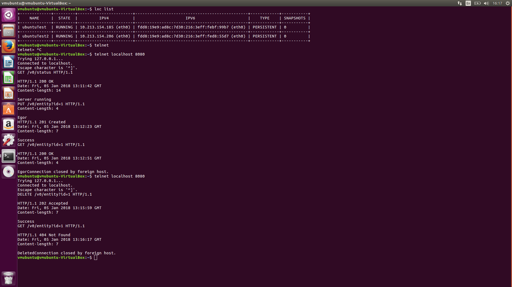
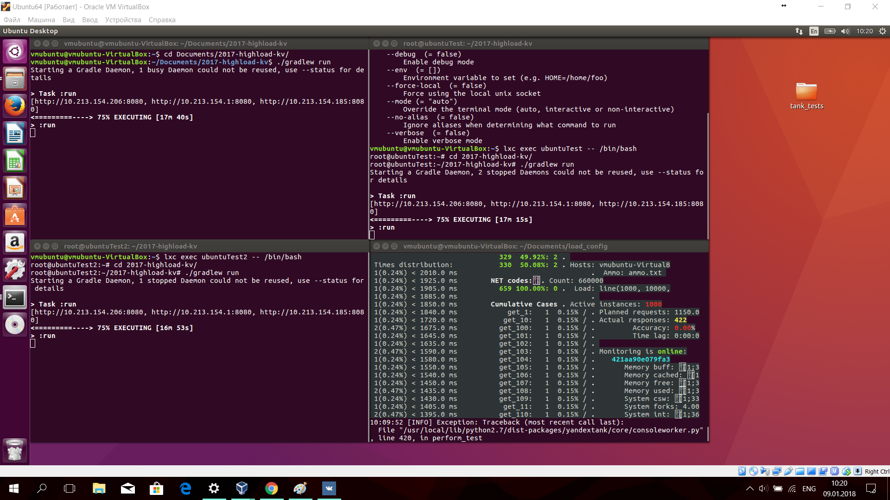

# Нагрузочное тестирование
## Настройка тестовой среды

Для тестирования был настроен кластер из трёх узлов, развёрнутый в виртуальной машине и контейнерах, содержащихся в виртуальной машине.
Для создания виртуальной машины использовался Oracle VirtualBox. На виртуальную машину была установлена ОС Ubuntu LTE 16.04. Была насроено сетевое подключение между гостевой системой (Ubuntu LTE 16.04) и хостовой системой (Windows 10). Ещё два узла кластера запускались в linux контейнерах (LXC, использовались предоставленные образы ubuntu-daily:16.04). Для создания и настройки контейнеров было использовано руководство по LXC с официального сайта Ubuntu: https://linuxcontainers.org/lxd/getting-started-cli/.

Для запуска узлов кластера на виртуальной машине и на контейнере использовался предоставленый скрипт gradlew, но в качестве целевого приложения использовался не Cluster, а измененная версия класса Server, в которую передаётся топология созданого кластера:

```
final Set<String> topology = new HashSet<>(3);
topology.add("http://10.213.154.1:8080");
topology.add("http://10.213.154.185:8080");
topology.add("http://10.213.154.206:8080");
```

На скриншоте приведённом ниже показана конфигурация linux контейнеров и результаты ручного тестирования кластера с помощью telnet:


## Smoke testing with curl

После настройки и первичного ручного тестирования кластерной конфигурации хранилища на виртуальной машине и контейнерах было проведено дымовое тестирования с помощью утилиты curl. Утилита curl запускалась из виртуальной машины с операционной системой Ubuntu, и запросы отправлялись на узел кластера, запущенный на этой виртуальной машине.

Сначала в цикле было создано 1000 entities с помощью запроса PUT:
```
$ for i in $(seq 0 1000); do time curl -X PUT -d value$i http://localhost:8080/v0/entity?id=key$i; done
```
Далее были проведены GET запросы на получение созданных entities:
```
$ for i in $(seq 0 1000); do time curl -X GET http://localhost:8080/v0/entity?id=key$i; done
```
Также было проведено тестирования запроса на удаление созданных entities:
```
$ for i in $(seq 0 1000); do time curl -X DELETE http://localhost:8080/v0/entity?id=key$i; done
```
И тестирования запроса к удалённым entities (повторный запуск цикла запросов GET).

Дымового тестирования, которое показало, что кластер работает корректно (корректно работают запросы GET, PUT, DELETE). Также с помощью утилиты time было оценено "на глаз" среднее время ответа кластера, которое составило ("на глаз") 35-40 мс.

## Нагрузочное тестирование wrk

Далее было проведено нагрузочное тестирование с помощью wrk. Для тестирования использовались следующие скрипты:

### Тестирование PUT
```
request = function()
  wrk.headers["Connection"] = "Keep-Alive"
  param_value = math.random(1,10000)
  wrk.body = "value" .. param_value
  path = "/v0/entity?id=" .. param_value .. "&replicas=2/3"
  return wrk.format("PUT", path)
end
```

### Тестирование GET
```
request = function()
  wrk.headers["Connection"] = "Keep-Alive"
  param_value = math.random(1,10000)
  path = "/v0/entity?id=" .. param_value .. "&replicas=2/3"
  return wrk.format("GET", path)
end
```

### Тестирование PUT/GET
```
cur_request = math.random(1,2)
if cur_request == 1 then
  request = function()
    wrk.headers["Connection"] = "Keep-Alive"
    param_value = math.random(1,10000)
    wrk.body = "value" .. param_value
    path = "/v0/entity?id=" .. param_value .. "&replicas=2/3"
    return wrk.format("PUT", path)
  end
else
  request = function()
    wrk.headers["Connection"] = "Keep-Alive"
    param_value = math.random(1,10000)
    path = "/v0/entity?id=" .. param_value .. "&replicas=2/3"
    return wrk.format("GET", path)
  end
end
```

Также использовались аналогичные скрипты для значения параметра replicas=3/3.

Тестирование проводилось в 1, 2 и 4 соединения (и потока) по 2 минуты каждый тест. Ниже приведены результаты тестов:

## Replicas 2/3
### 1 соединение и поток
PUT:
```
$ wrk --latency -t1 -c1 -d2m -s put.lua http://localhost:8080
Running 2m test @ http://localhost:8080
  1 threads and 1 connections
  Thread Stats   Avg      Stdev     Max   +/- Stdev
    Latency    48.94ms    9.95ms 323.05ms   96.11%
    Req/Sec    20.41      3.92    30.00     84.41%
  Latency Distribution
     50%   47.74ms
     75%   51.49ms
     90%   55.15ms
     99%   67.41ms
  2463 requests in 2.00m, 209.34KB read
Requests/sec:     20.51
Transfer/sec:      1.74KB
```
GET:
```
wrk --latency -t1 -c1 -d2m -s get_2_3.lua http://localhost:8080
Running 2m test @ http://localhost:8080
  1 threads and 1 connections
  Thread Stats   Avg      Stdev     Max   +/- Stdev
    Latency    48.38ms    3.78ms  78.68ms   72.17%
    Req/Sec    20.47      3.72    30.00     85.65%
  Latency Distribution
     50%   47.91ms
     75%   50.00ms
     90%   52.48ms
     99%   61.12ms
  2476 requests in 2.00m, 202.89KB read
Requests/sec:     20.63
Transfer/sec:      1.69KB
```
PUT/GET:
```
$ wrk --latency -t1 -c1 -d2m -s put_get_2_3.lua http://localhost:8080
Running 2m test @ http://localhost:8080
  1 threads and 1 connections
  Thread Stats   Avg      Stdev     Max   +/- Stdev
    Latency    49.64ms    4.77ms  85.70ms   71.04%
    Req/Sec    19.94      3.79    30.00     85.40%
  Latency Distribution
     50%   48.48ms
     75%   51.78ms
     90%   55.84ms
     99%   63.83ms
  2414 requests in 2.00m, 197.81KB read
Requests/sec:     20.10
Transfer/sec:      1.65KB
```
### 2 соединения и потока
PUT:
```
$ wrk --latency -t2 -c2 -d2m -s put.lua http://localhost:8080
Running 2m test @ http://localhost:8080
  2 threads and 2 connections
  Thread Stats   Avg      Stdev     Max   +/- Stdev
    Latency    47.56ms    5.45ms 156.96ms   90.60%
    Req/Sec    20.92      3.93    30.00     83.29%
  Latency Distribution
     50%   46.69ms
     75%   48.58ms
     90%   52.67ms
     99%   63.85ms
  5046 requests in 2.00m, 428.87KB read
Requests/sec:     42.02
Transfer/sec:      3.57KB
```
GET:
```
$ wrk --latency -t2 -c2 -d2m -s get_2_3.lua http://localhost:8080
Running 2m test @ http://localhost:8080
  2 threads and 2 connections
  Thread Stats   Avg      Stdev     Max   +/- Stdev
    Latency    45.79ms    3.26ms  92.71ms   89.90%
    Req/Sec    21.71      4.11    30.00     79.30%
  Latency Distribution
     50%   44.43ms
     75%   47.60ms
     90%   48.80ms
     99%   57.04ms
  5236 requests in 2.00m, 428.98KB read
Requests/sec:     43.61
Transfer/sec:      3.57KB
```
PUT/GET:
```
$ wrk --latency -t2 -c2 -d2m -s put_get_2_3.lua http://localhost:8080
Running 2m test @ http://localhost:8080
  2 threads and 2 connections
  Thread Stats   Avg      Stdev     Max   +/- Stdev
    Latency    46.16ms    3.82ms  99.52ms   87.45%
    Req/Sec    21.53      4.10    30.00     80.15%
  Latency Distribution
     50%   44.51ms
     75%   47.81ms
     90%   51.16ms
     99%   59.67ms
  5193 requests in 2.00m, 425.53KB read
Requests/sec:     43.27
Transfer/sec:      3.55KB
```
### 4 соединения и потока
PUT:
```
$ wrk --latency -t4 -c4 -d4m -s put.lua http://localhost:8080
Running 4m test @ http://localhost:8080
  4 threads and 4 connections
  Thread Stats   Avg      Stdev     Max   +/- Stdev
    Latency    47.10ms    5.32ms 256.76ms   92.93%
    Req/Sec    21.13      3.99    30.00     82.49%
  Latency Distribution
     50%   46.03ms
     75%   48.23ms
     90%   51.73ms
     99%   65.13ms
  20374 requests in 4.00m, 1.69MB read
Requests/sec:     84.86
Transfer/sec:      7.21KB
```
GET:
```
$ wrk --latency -t4 -c4 -d2m -s get_2_3.lua http://localhost:8080
Running 2m test @ http://localhost:8080
  4 threads and 4 connections
  Thread Stats   Avg      Stdev     Max   +/- Stdev
    Latency    50.63ms    7.12ms 109.08ms   78.78%
    Req/Sec    19.59      4.49    30.00     80.22%
  Latency Distribution
     50%   48.34ms
     75%   55.10ms
     90%   60.15ms
     99%   71.45ms
  9471 requests in 2.00m, 776.10KB read
Requests/sec:     78.86
Transfer/sec:      6.46KB
```
PUT/GET:
```
$ wrk --latency -t4 -c4 -d2m -s put_get_2_3.lua http://localhost:8080
Running 2m test @ http://localhost:8080
  4 threads and 4 connections
  Thread Stats   Avg      Stdev     Max   +/- Stdev
    Latency    51.33ms    7.35ms 115.09ms   69.19%
    Req/Sec    19.31      4.49    30.00     80.16%
  Latency Distribution
     50%   48.83ms
     75%   56.02ms
     90%   61.01ms
     99%   71.38ms
  9339 requests in 2.00m, 765.21KB read
Requests/sec:     77.77
Transfer/sec:      6.37KB
```

## Replicas 3/3
### 1 соединение и поток
PUT:
```
$ wrk --latency -t1 -c1 -d2m -s put_3_3.lua http://localhost:8080
Running 2m test @ http://localhost:8080
  1 threads and 1 connections
  Thread Stats   Avg      Stdev     Max   +/- Stdev
    Latency    47.61ms    4.43ms  93.14ms   84.86%
    Req/Sec    20.85      3.91    30.00     83.24%
  Latency Distribution
     50%   47.07ms
     75%   49.72ms
     90%   52.65ms
     99%   60.65ms
  2517 requests in 2.00m, 213.92KB read
Requests/sec:     20.97
Transfer/sec:      1.78KB
```
GET:
```
$ wrk --latency -t1 -c1 -d2m -s get_3_3.lua http://localhost:8080
Running 2m test @ http://localhost:8080
  1 threads and 1 connections
  Thread Stats   Avg      Stdev     Max   +/- Stdev
    Latency    49.96ms    5.93ms 184.20ms   80.69%
    Req/Sec    19.86      3.71    30.00     86.44%
  Latency Distribution
     50%   48.55ms
     75%   52.19ms
     90%   56.13ms
     99%   65.76ms
  2401 requests in 2.00m, 196.75KB read
Requests/sec:     20.00
Transfer/sec:      1.64KB
```
PUT/GET:
```
wrk --latency -t1 -c1 -d2m -s put_get_3_3.lua http://localhost:8080
Running 2m test @ http://localhost:8080
  1 threads and 1 connections
  Thread Stats   Avg      Stdev     Max   +/- Stdev
    Latency    46.90ms    3.98ms  94.30ms   84.24%
    Req/Sec    21.18      3.91    30.00     82.61%
  Latency Distribution
     50%   45.95ms
     75%   48.24ms
     90%   51.65ms
     99%   59.97ms
  2556 requests in 2.00m, 209.45KB read
Requests/sec:     21.29
Transfer/sec:      1.74KB
```
### 2 соединения и потока
PUT:
```
$ wrk --latency -t2 -c2 -d2m -s put_3_3.lua http://localhost:8080
Running 2m test @ http://localhost:8080
  2 threads and 2 connections
  Thread Stats   Avg      Stdev     Max   +/- Stdev
    Latency    48.43ms    4.86ms 210.49ms   86.40%
    Req/Sec    20.50      3.71    30.00     85.83%
  Latency Distribution
     50%   47.93ms
     75%   50.91ms
     90%   52.79ms
     99%   59.84ms
  4953 requests in 2.00m, 420.97KB read
Requests/sec:     41.24
Transfer/sec:      3.51KB
```
GET:
```
$ wrk --latency -t2 -c2 -d2m -s get_3_3.lua http://localhost:8080
Running 2m test @ http://localhost:8080
  2 threads and 2 connections
  Thread Stats   Avg      Stdev     Max   +/- Stdev
    Latency    45.84ms    3.15ms  91.00ms   88.99%
    Req/Sec    21.68      4.15    30.00     79.27%
  Latency Distribution
     50%   44.46ms
     75%   47.72ms
     90%   48.92ms
     99%   56.51ms
  5231 requests in 2.00m, 428.64KB read
Requests/sec:     43.57
Transfer/sec:      3.57KB
```
PUT/GET:
```
$ wrk --latency -t2 -c2 -d2m -s put_get_3_3.lua http://localhost:8080
Running 2m test @ http://localhost:8080
  2 threads and 2 connections
  Thread Stats   Avg      Stdev     Max   +/- Stdev
    Latency    48.73ms    5.71ms 105.67ms   80.89%
    Req/Sec    20.35      4.32    30.00     81.01%
  Latency Distribution
     50%   47.69ms
     75%   51.80ms
     90%   56.21ms
     99%   64.66ms
  4917 requests in 2.00m, 402.92KB read
Requests/sec:     40.97
Transfer/sec:      3.36KB
```
### 4 соединения и потока
PUT:
```
$ wrk --latency -t4 -c4 -d2m -s put_3_3.lua http://localhost:8080
Running 2m test @ http://localhost:8080
  4 threads and 4 connections
  Thread Stats   Avg      Stdev     Max   +/- Stdev
    Latency    45.98ms    3.10ms 120.80ms   89.58%
    Req/Sec    21.65      4.02    30.00     80.74%
  Latency Distribution
     50%   44.63ms
     75%   47.84ms
     90%   48.87ms
     99%   55.26ms
  10434 requests in 2.00m, 0.87MB read
Requests/sec:     86.89
Transfer/sec:      7.38KB
```
GET:
```
$ wrk --latency -t4 -c4 -d2m -s get_3_3.lua http://localhost:8080
Running 2m test @ http://localhost:8080
  4 threads and 4 connections
  Thread Stats   Avg      Stdev     Max   +/- Stdev
    Latency    46.87ms    4.55ms 103.19ms   86.90%
    Req/Sec    21.21      4.18    30.00     80.71%
  Latency Distribution
     50%   45.06ms
     75%   48.20ms
     90%   51.86ms
     99%   62.83ms
  10232 requests in 2.00m, 838.37KB read
Requests/sec:     85.20
Transfer/sec:      6.98KB
```
PUT/GET:
```
$ wrk --latency -t4 -c4 -d2m -s put_get_3_3.lua http://localhost:8080
Running 2m test @ http://localhost:8080
  4 threads and 4 connections
  Thread Stats   Avg      Stdev     Max   +/- Stdev
    Latency    52.92ms    7.37ms 109.77ms   70.07%
    Req/Sec    18.73      4.20    30.00     81.66%
  Latency Distribution
     50%   51.68ms
     75%   57.58ms
     90%   62.94ms
     99%   72.06ms
  9057 requests in 2.00m, 742.03KB read
Requests/sec:     75.44
Transfer/sec:      6.18KB
```

## Нагрузочное тестирование Yandex-Tank

Для оптимизированного варианта хранилища (см. ниже, секция "Оптимизация") было проведено нагрузочное тестирование с помощью пакета Yandex-Tank с генератором нагрузки Phantom. Набор патрон для генератора был создан с помощью Python скрипта:
```
#!/usr/bin/python
# -*- coding: utf-8 -*-

import sys

def make_ammo(method, url, headers, case, body):
    """ makes phantom ammo """
    #http request w/o entity body template
    req_template = (
          "%s %s HTTP/1.1\r\n"
          "%s\r\n"
          "\r\n"
    )

    #http request with entity body template
    req_template_w_entity_body = (
          "%s %s HTTP/1.1\r\n"
          "%s\r\n"
          "Content-Length: %d\r\n"
          "\r\n"
          "%s\r\n"
    )

    if not body:
        req = req_template % (method, url, headers)
    else:
        req = req_template_w_entity_body % (method, url, headers, len(body), body)

    #phantom ammo template
    ammo_template = (
        "%d %s\n"
        "%s"
    )

    return ammo_template % (len(req), case, req)

def main():
    headers_GET = "Host: localhost:8080\r\n" + \
            "User-Agent: tank\r\n" + \
            "Accept: */*\r\n" + \
            "Connection: Close"

    f = open("ammo.txt", "w")
    for i in range(1, 10001):
        

	url = "/v0/entity?id=key{}".format(i)
	case = "get_{}".format(i)
        f.write(make_ammo("GET", url, headers_GET, case, ""))
	body = "value{}".format(i)
        case = "put_{}".format(i)
	headers_PUT = "Host: localhost:8080\r\n" + \
	    "Content-Length: {}\r\n".format(len(body)) + \
            "User-Agent: tank\r\n" + \
            "Accept: */*\r\n" + \
            "Connection: Close"
	f.write(make_ammo("PUT", url, headers_PUT, case, body))
	f.write("\r\n")
    f.close();

if __name__ == "__main__":
    main()
```
Скрипт генерирует набор патрон для стрельбы по хранилищу. Лента патрон состоит из PUT и GET запросов (default replicas values).

Для тестирования использовалась то же тестовое окружение, что и раньше (три узла: один на виртуальной машине, два в контейнерах на этой же виртуальной машине).

К инсталяции yandex tank версии 1.9 не удалось подключить плагин для онлайн отрисовки статистики (yandex-online). Результаты анализировались по онлайн консольному выводу, также были изучены созданный Phantom файлы с отчётами. Было проведено два теста, перед тестами хранилище было заполнено 10 000 entities, на которые проводились запросы:

### 1 - 1000 RPS за две минуты
Данный тест прошёл успешно. Результаты привидены в репозитории, в папке yandex-tank/tank_tests/1.

### 2 - 1000 - 10 000 RPS за две минуты
Данный тест завершился не успешно, поскольку не хватило ОП на тестовой виртуальной машине для обеспечения работы yandex-tank. Yandex-tank прекратил работу, выдав максимально 422 RPS. Виртуальной машине было выделено 4 ГБ оперативной памяти. Перед отключением yandex-tank показывал, что время ответа кластера в среднем превышало две секунды. Результаты тестирования приведены в папке yandex-tank/tank_tests/2.

Ниже приведён скриншот тестовой ВМ во время работы yandex-tank:


# Профилирование

Для профилирования использовался async-profiler, который подключался к java машине, запущенной на виртуальной машине. На время профилирование (30 секунд) на кластер подавалась нагрузка из смешанных PUT и GET запросов с помощью ранее реализованного lua скрипта и утириты wrk. Результаты профилирования были сохранены в файл и преобразованы в график с помощью скрипта flamegrahp.pl (https://github.com/BrendanGregg/FlameGraph).

Ниже приведён полученный график с результатами профилирования:


Результат профилирования показал, что lua скрипт, подающий PUT/GET нагрузку, работает некоректно, так как вся нагрузка состоит только из GET запросов. По результатам профилирования (только GET запросы) было выявлено, что 32% сэмплов приходится на реализованный обработчик запросов (v0/entity handler), из которых большая часть времени уходит на функции, реализующие сетевое взаимодействие: httpSendRequestGet и sendHttpRespond - суммарно около 30% сэмплов. Относительно сетевых взаимодействий функции реализующие локальное хранение данных по результатам профилирования занимают незначительное время несмотря на то, что хранения key-value пар было реализовано не оптимально (DaoFiles): DaoFiles.getData - 0.77% сэмплов. 

Значительная часть сэмплов пришлась на функции реализующие запуск потоков: start_thread - 48% сэмплов. Уменьшить число переключения потоков можно изменив реализацию изменения данных на локальном узле. В реализации, для которой проводилось профилирование, узел, на который приходит внешний запрос, производит рассылку внутренних запросов на узлы, отвечающие за запрашиваемый ID. В том числе, если сам узел, получивший запрос, оказывается во множесте узлов, ответственных за данный ID, он производил отправку запроса самому себе, что исходя из реализации http сервера, постовляемого с jdk, приводило к созданию нового потока, обрабатывающего этот запрос, в то время, как исходный поток, обрабатывающий внешний запрос, дожидался завершения нового потока. Таким образом происходит бесполезное создание потока, которое можно избежать, отслеживая факт того, что запрос будет отправлен на текущий узел кластера. 

После обнаружения неисправности в lua скрипте, генерирующем PUT/GET запросы, он был переписан:
```
request = function()
  wrk.headers["Connection"] = "Keep-Alive"
  param_value = math.random(1,10000)
  path = "/v0/entity?id=" .. param_value .. "&replicas=3/3"
  rand_choise = math.random(1,2)
  if rand_choise == 1 then
    wrk.body = "value" .. param_value
    return wrk.format("PUT", path)
  else
    return wrk.format("GET", path)
  end
end
```
Новый скрипт был проверен на корректность работы, было проверено, что скрипт генерирует как GET, так и PUT запросы.

Используя новый скрипт для создания нагрузки на кластер процесс профилирования был повторён:


## Оптимизация

С целью оптимизации в реализацию распределённого хранилища были внесены изменения, позволяющие определять, что узел, обрабатывающий внешний запрос, отвечает за обработку текущего ID. Используя эту информацию было сокращено число http запросов к узлам, поскольку запрашивание данных с текущего узла производится локально.

С использованием исправленного скрипта, создающего смешанную нагрузку, было проведено нагрузочное тестирование для старой и оптимизированной реализаций хранилища. Для каждого теста (перезапуска хранилища) перед тестом производилась заполнение хранилищ 10 тысячами значений с помощью утилиты curl.

Результаты тестирования:
KVStorage (изначальный вариант реализации):
```
$ wrk --latency -t4 -c4 -d2m -s put_get_3_3.lua http://localhost:8080
Running 2m test @ http://localhost:8080
  4 threads and 4 connections
  Thread Stats   Avg      Stdev     Max   +/- Stdev
    Latency    47.19ms    7.78ms 184.39ms   96.13%
    Req/Sec    21.12      4.36    30.00     79.45%
  Latency Distribution
     50%   44.97ms
     75%   48.01ms
     90%   51.22ms
     99%   88.43ms
  10190 requests in 2.00m, 0.86MB read
Requests/sec:     84.86
Transfer/sec:      7.36KB
```
KVStorageEnlightenNode (оптимизация):
```
$ wrk --latency -t4 -c4 -d2m -s put_get_3_3.lua http://localhost:8080
Running 2m test @ http://localhost:8080
  4 threads and 4 connections
  Thread Stats   Avg      Stdev     Max   +/- Stdev
    Latency    46.91ms    7.40ms 148.11ms   96.32%
    Req/Sec    21.24      4.40    30.00     78.74%
  Latency Distribution
     50%   44.74ms
     75%   47.87ms
     90%   50.16ms
     99%   88.26ms
  10244 requests in 2.00m, 0.87MB read
Requests/sec:     85.31
Transfer/sec:      7.40KB
```

Результаты тестирования показали, что произведённые изменения привели к очень незначительной оптимизации.

Также было проведено профилирования для реализации KVStorageEnlightenNode:


Данное профилирование показало, что несмотря на то, что оптимизация была нацелена на сокращение числа создаваемых потоков на узлах сервера и оптимизация была успешно (пропускная способность кластера увеличилась), количество сэмплов пришедшихся на функции, отвечающие за запуск потоков увеличилось. Возможно это связано с тем, что сократилось время, проводимое узлом в ожидание ответов на внутрение http запросы, хотя это маловероятно, так как http запросы на loopback интерфейс (которые были устранены в оптимизированой версии) в большинстве операционных систем обрабатываются отдельно для обеспечения высоких скоростей ответов с loopback интерфейсов.

Результаты профилирования оптимизированной версии показали, что 45% сэмплов приходится на функции сетевого взаимодействия (connection.connect(), getResponseCode(), etc.), 35% cэмплов приходится на запуск потоков (30%) и работу диспетчера заданий потоков, около 5% сэмплов приходится на работу функций DaoFiles. Таким образом дальнейшее эффективное оптимизирование хранилища следует проводить путем замены сетевой части (сервера) на неблокирующийся сервер, чтобы сократить число потоков и, следовательно, переключений контекста потоков.
